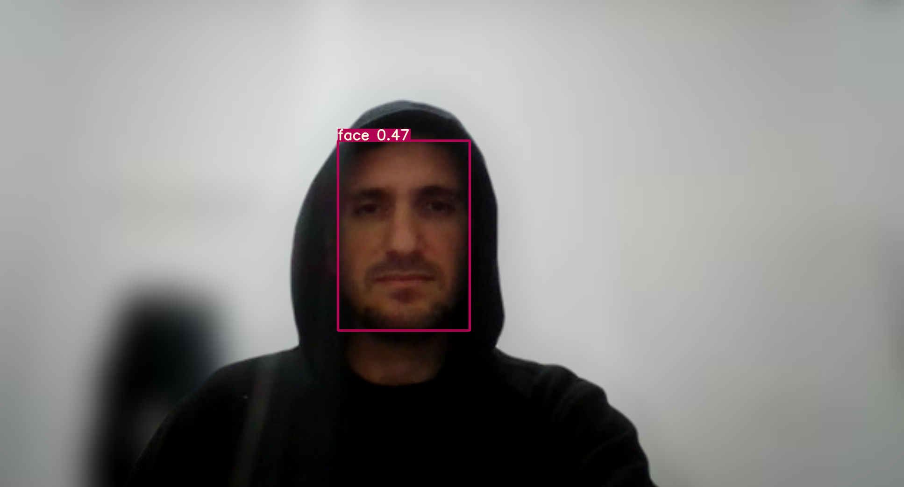
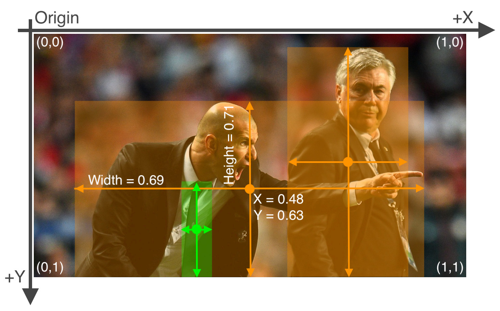

## Training YOLOV7 on custom dataset
### Step1: Clone the repository

I have trained yolov7 on WiderFace dataset to detect face in images.

# Demo 1

[](https://youtu.be/T7QT4JxB36M)

# Demo 2 [Multiple faces + Mask]

[](https://youtu.be/s3ga6vWnYXg)


```bash
git clone --recursive https://github.com/majnas/yolov7_custom_dataset.git
cd yolov7_custom_dataset/yolov7

pip install -r requirements.txt
```
### Step2: Download pretrained face detection from here and place in folder pretrained
```log
├── custom
│   ├── images
│   ├── labels
│   ├── train.cache
│   ├── train.txt
│   ├── val.cache
│   └── val.txt
├── data
│   └── yolov7_label_format.png
├── demo
├── README.md
└── yolov7
    ├── cfg
    ├── data
    ├── detect.py
    ├── figure
    ├── hubconf.py
    ├── inference
    ├── LICENSE.md
    ├── models
    ├── pretrained    # place pretrained model in this folder
    ├── README.md
    ├── requirements.txt
    ├── runs
    ├── scripts
    ├── test.py
    ├── train.py
    └── utils

```

### Step3: To inference face detection use this command
```shell
cd yolov7
python detect.py --weights ./pretrained/best.pt --conf 0.25 --img-size 640 --source ../data/me.png
```

#### Sample Output



## Preparing Custom dataset
### Step1: Custom dataset structure
```log
├── custom
    ├── images
    │   ├── train
    │   │   ├── train_A.jpg
    │   │   ├── train_B.jpg
    │   │   ├── ...
    │   │   └── train_X.jpg
    │   ├── test
    │   │   ├── test_A.jpg
    │   │   ├── test_B.jpg
    │   │   ├── ...
    │   │   └── test_X.jpg
    │   └── val
    │       ├── val_A.jpg
    │       ├── val_B.jpg
    │       ├── ...
    │       └── val_X.jpg
    ├── labels
    │   ├── train
    │   │   ├── train_A.txt
    │   │   ├── train_B.txt
    │   │   ├── ...
    │   │   └── train_X.txt
    │   ├── test
    │   │   ├── test_A.txt
    │   │   ├── test_B.txt
    │   │   ├── ...
    │   │   └── test_X.txt
    │   └── val
    │       ├── val_A.txt
    │       ├── val_B.txt
    │       ├── ...
    │       └── val_X.txt
    ├── train.txt
    ├── test.txt
    └── val.txt
```


### label text file format 
Label format in yolov7 is the same as yolov5



[Image source](https://blog.paperspace.com/content/images/size/w1000/2021/03/image-25.png)

```
class_id relative_center_x relative_center_y 0.relative_center_width relative_center_height
```
#### Sample text file
``` log
0 0.48 0.63 0.69 0.71 
0 0.2646484375 0.505859375 0.03125 0.05078125 
```

```
├── train.txt   # Include paths to images in train folder
├── test.txt    # Include paths to images in test folder
└── val.txt     # Include paths to images in val folder
```

#### Sample train.txt file
```
/home/dev/yolov7_custom_dataset/custom/images/train/train_A.jpg
/home/dev/yolov7_custom_dataset/custom/images/train/train_B.jpg
/home/dev/yolov7_custom_dataset/custom/images/train/train_C.jpg
/home/dev/yolov7_custom_dataset/custom/images/train/train_X.jpg
```

### Step2: Prepare data file
To make a data file for custom dataset make a copy of ./data/coco.yaml then rename it to custom.yaml and change the paths and class numbers and names as follows.

```
train: ../custom/train.txt
val: ../custom/val.txt
test: ../custom/test.txt

# number of classes
nc: 1

# class names
names: [ 'face', ]
```

### Step3: Prepare config file
To make a new config file for your custom training make a copy of ./cfg/training/yolov7.yaml then rename it to yolov7_custom.yaml and change the number of classes in the file as follows.

```
# parameters
nc: 1  # number of classes # change this line only
depth_multiple: 1.0  # model depth multiple
width_multiple: 1.0  # layer channel multiple

# anchors
anchors:
  - [12,16, 19,36, 40,28]  # P3/8
  - [36,75, 76,55, 72,146]  # P4/16
  - [142,110, 192,243, 459,401]  # P5/32

# yolov7 backbone
backbone:
  # [from, number, module, args]
  [[-1, 1, Conv, [32, 3, 1]],  # 0
  
   [-1, 1, Conv, [64, 3, 2]],  # 1-P1/2      
   [-1, 1, Conv, [64, 3, 1]],
   
```

### Step4: To train on custom dataset run these commands
Single GPU training
```
python train.py --workers 8 --device 0 --batch-size 32 --data data/custom.yaml --img 640 640 --cfg cfg/training/yolov7_custom.yaml --weights '' --name yolov7 --hyp data/hyp.scratch.p5.yaml
```

Multiple GPU training
```
python -m torch.distributed.launch --nproc_per_node 4 --master_port 9527 train.py --workers 8 --device 0,1,2,3 --sync-bn --batch-size 128 --data data/custom.yaml --img 640 640 --cfg cfg/training/yolov7_custom.yaml --weights '' --name yolov7 --hyp data/hyp.scratch.p5.yaml
```
